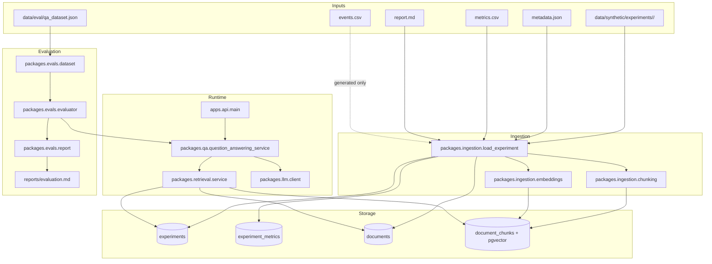

# Architecture

ExperimentOS AI is a backend-first repository for experiment knowledge workflows. Today it focuses on four concrete paths:

1. Ingest experiment artifacts from the synthetic corpus.
2. Store reports, metrics, and document chunks in Postgres.
3. Retrieve semantically relevant report chunks with pgvector.
4. Answer experiment questions and evaluate that QA flow offline.

## System Diagram

## Component Boundaries

### API Layer

`apps/api/main.py` owns FastAPI application setup, request validation, dependency wiring, and HTTP error mapping.

Current endpoints:

- `GET /health`
- `POST /ask`

The API does not implement ingestion, retrieval, or answer generation itself. It delegates those concerns to package-level services.

### Ingestion Layer

`packages/ingestion/` is responsible for transforming experiment folders into database records.

Current behavior:

- Validates that each experiment folder includes `metadata.json`, `metrics.csv`, and `report.md`.
- Parses experiment metadata with Pydantic models.
- Parses metric rows from CSV.
- Chunks Markdown reports into retrieval units.
- Optionally generates embeddings for each chunk.
- Replaces existing records when an experiment with the same name is re-ingested.

Important constraint:

- `events.csv` is generated in the synthetic corpus but is not yet ingested into the database.

### Storage Layer

`packages/db/models.py` defines the persistence model:

- `Experiment`
- `ExperimentMetric`
- `Document`
- `DocumentChunk`

Key design choices:

- Primary identifiers are database UUIDs.
- The original synthetic experiment ID is preserved in `Experiment.config["experiment_id"]`.
- Chunk embeddings are stored in `DocumentChunk.embedding` using pgvector.
- `DocumentChunk.chunk_metadata` stores retrieval-friendly metadata such as chunk index and section labels.

### Retrieval Layer

`packages/retrieval/` performs semantic search over stored document chunks.

It supports:

- free-form query search across all experiments
- experiment-scoped search by experiment UUID
- optional metadata filters in the CLI
- retrieval metrics for embedding time, vector search time, retrieved count, and average similarity

The retrieval layer is shared by both the API and the evaluation harness.

### Question Answering Layer

`packages/qa/question_answering_service.py` owns the grounded QA flow:

1. Validate the question.
2. Confirm the experiment exists.
3. Retrieve the top `k` relevant chunks for that experiment.
4. Build a grounded prompt from the retrieved evidence.
5. Ask the selected LLM client for an answer.
6. Return the answer with citations, retrieved chunks, and runtime metrics.

If retrieval returns no chunks, the service returns an "insufficient evidence" answer without calling an external LLM.

### Evaluation Layer

`packages/evals/` turns the QA path into a repeatable offline measurement workflow.

Inputs:

- evaluation dataset records from `data/eval/qa_dataset.json`
- retrieved experiment evidence from Postgres
- a selected embedding provider and LLM provider

Outputs:

- aggregate retrieval and citation metrics
- per-question evaluation samples
- Markdown report written to `reports/evaluation.md` by default

## Data Flow

### Ingestion Flow

1. A synthetic experiment folder is generated or updated locally.
2. `packages.ingestion.load_experiment` reads `metadata.json`, `metrics.csv`, and `report.md`.
3. The report is chunked into section-aware text slices.
4. Embeddings are generated unless `--skip-embeddings` is used.
5. Experiment, metric, document, and chunk rows are stored in Postgres.

### `/ask` Flow

1. FastAPI validates the request body.
2. The API resolves an async database session.
3. The QA service validates the supplied experiment UUID.
4. The retrieval service performs a pgvector similarity search scoped to that experiment.
5. The QA service builds a grounded prompt and invokes the configured LLM client.
6. The API returns answer text, citations, retrieved chunks, and metrics.

### Evaluation Flow

1. The evaluation dataset is loaded from JSON.
2. The evaluator maps synthetic experiment IDs to database UUIDs through `Experiment.config`.
3. Each question is answered through the same QA service used by the API.
4. Metrics are aggregated and rendered into a Markdown report.

## Package Overview

| Package | Responsibility |
| --- | --- |
| `packages/config` | Environment loading and configuration helpers |
| `packages/db` | SQLAlchemy models, engine creation, session factory |
| `packages/ingestion` | File parsing, chunking, embeddings, ingestion CLI |
| `packages/retrieval` | Retrieval service and CLI |
| `packages/llm` | LLM client abstractions and provider-specific implementations |
| `packages/qa` | Grounded question answering service and response models |
| `packages/evals` | Evaluation dataset loading, orchestration, metrics, reports |
| `packages/experiments` | Reserved boundary for future experiment domain logic |
| `packages/agents` | Reserved boundary for future agent workflows |

## Extension Points

The current architecture intentionally leaves room for future work without changing the core contracts:

- ingest `events.csv` into storage and retrieval
- add richer retrieval filters and ranking strategies
- expand evaluation metrics and regression reporting
- expose more API endpoints around experiments, retrieval, or reports
- build agent workflows on top of the ingestion, retrieval, and QA services

Those extensions should preserve the current package boundaries unless the codebase grows enough to justify new ones.
